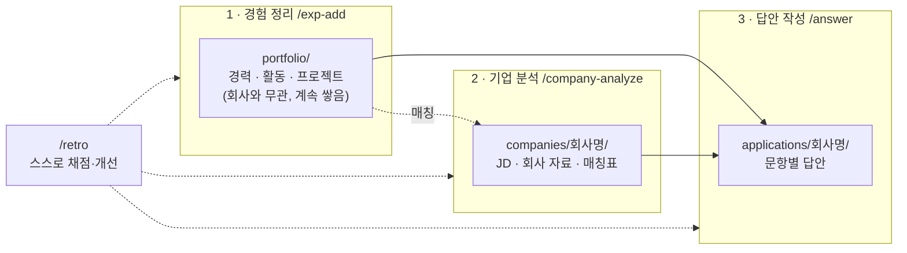
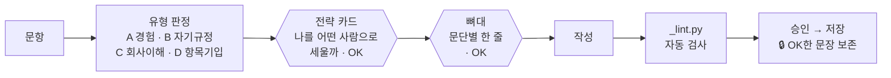
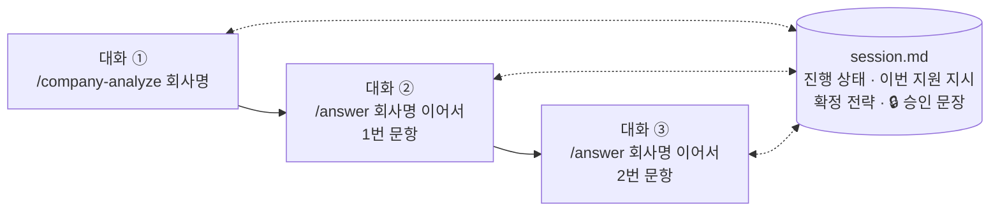

# 지원서 에이전트

내 경험을 한 번 정리해 두면, 지원하는 회사와 문항에 맞춰 **근거 있는 자기소개서 답안**을 함께 만드는 Claude Code 에이전트입니다.
없는 경험이나 수치는 만들지 않습니다. 모든 문장은 내가 정리한 경험 파일에 근거합니다.

> 이 저장소에는 **에이전트 구조(규칙·스킬·스크립트·템플릿)만** 있습니다. 경험·회사 분석·답안은 `.gitignore`로 빠져 내 컴퓨터에만 남습니다.

## 구조



| 단계 | 명령 | 결과물 | 언제 |
|---|---|---|---|
| 1. 경험 정리 | `/exp-add` | 경험 1건 = 파일 1개 (STAR + 태그 + 증거 조각) | 새 경험이 생길 때 |
| 2. 기업 분석 | `/company-analyze` | `jd.md` · `context.md` · `fit-matrix.md` | 회사마다 한 번 |
| 3. 답안 작성 | `/answer` | `answers.md`에 문항별 답안 누적 | 문항마다 |
| 자체 개선 | `/retro` | 채점 · 서류 결과 비교 · 회귀 테스트 → `IMPROVEMENTS.md` | 한 지원을 끝냈을 때 |

## 답안은 이렇게 만들어진다

문장을 쓰기 전에 **전략부터 확정**하고, 단계마다 내 OK를 받아야 넘어갑니다.



## 지원할 때: 작업 하나 = 대화 하나

AI는 답할 때마다 대화 전체를 다시 읽습니다. 그래서 작업이 끝나면 새 대화를 열고, 기억은 `session.md`가 넘깁니다.



- 끊을 때가 되면 에이전트가 먼저 제안합니다.
- PDF·이미지 자료는 채팅창에 붙이지 말고 **파일 경로**로 알려 주세요. 텍스트로 바꿔 필요한 쪽만 읽습니다.

## 낸 뒤에: 결과를 적으면 에이전트가 배운다

각 `applications/회사명/answers.md` 첫머리에 세 줄을 적어 둡니다.

```
> 제출: 2026-09-15        (아직이면 미제출)
> 결과: 서류 합격         (서류 불합격 · 대기)
> 지원 유형: 인접 이동     (직무 정합 · 인접 이동 · 전환)
```

- **틀린 사실이 다시 나가지 않게**: 답안을 쓰다 사실을 바로잡으면 경험 원본까지 고칩니다. 바로 못 고치면 `_check.py`가 오류로 막습니다. 이미 낸 지원서에 틀린 표현이 있으면 고치지 않고 `## 면접 주의`에 적어 면접 때 대비합니다.
- **결과로 검증**: `/retro`가 합격·불합격 지원을 나란히 놓고 비교합니다. 규칙을 크게 바꾸면 승인했던 답안을 새 규칙으로 다시 써 보고(회귀 테스트) 예전 실수가 되풀이되는지 봅니다.

## 핵심 원칙

| 원칙 | 뜻 |
|---|---|
| 포지셔닝 먼저 | 답안은 경험 소개가 아니라 "HR이 나를 뽑을 이유" |
| 사실 불가침 | 없는 경험·수치·인과는 절대 쓰지 않는다 |
| 표현은 적극적으로 | 사실인 범위에서 가장 강하게. 불리한 건 생략해도 된다 |
| 선별 · 재조립 | 1~2개 경험을 골라 문항에 맞게 다시 배치 (복붙 금지) |
| 직무 중립 | 지원마다 전략을 새로 세운다 |

판단 기준: **"면접에서 이 문장을 파고들면 이어갈 수 있는가?"**

## 스크립트

에이전트가 알아서 실행합니다. 직접 돌려도 됩니다.

| 명령 | 하는 일 |
|---|---|
| `python3 portfolio/_check.py` | 경험 파일 ↔ INDEX 정합성 + 규칙 파일 분량 예산 + **지원서 사실 점검**(원본에 안 옮긴 정정, 제출본에 들어간 사실 오류 → `## 면접 주의`) (오류 0이 기준, `--sync`로 Codex 사본 갱신) |
| `python3 portfolio/_usage.py 회사명` | 경험 사용 횟수·편중 + 전체 경험 로스터(한 줄씩, ⭐ 정량 보강 1순위 · 💤 미활용 강한 재료). `--exp ID`: 다른 회사 답안에서 그 경험을 쓴 줄 + 그 경험의 미확인 사실 · `--results`: 회사별 제출·서류 결과·지원 유형·주력 계열 |
| `python3 portfolio/_index.py` | INDEX.md 재생성 — 표·연결 맵·태그 인덱스를 frontmatter에서 뽑는다(손으로 고치지 않는다, `_check.py`가 드리프트 검사) |
| `python3 portfolio/_lint.py 회사명` | 초안의 글자 수·문장 길이·금지 표현(`_terms.md`)·🔒 보존·복붙·라벨 복사·**원본에 없는·미확인 수치** 검사 (`--all`: 저장본 전체, 검사 못 한 문항도 알림 · `--coverage`: 지원서 전체 JD 키워드 커버리지) |
| `python3 portfolio/_regress.py` | 회귀 테스트 — 승인 답안을 현재 규칙으로 블라인드 재작성·채점할 지시문과 비교 재료 생성(`/retro`) |
| `python3 portfolio/_extract.py 파일 회사명` | PDF·이미지 → 텍스트 파일 + 목차 (`--find`, `--page`). 이력서 임포트는 회사명 대신 `_portfolio` |

`_extract.py`는 macOS에선 설치 없이 OCR까지 됩니다. Windows·Linux는 `pip install pypdf pypdfium2` + Tesseract(한국어)를 권장하고, 없으면 하위 에이전트가 대신 읽습니다.

## 시작하기

```bash
git clone https://github.com/ssxrxbx/Resume.git && cd Resume
for f in profile INDEX TAGS skills _history _terms; do cp portfolio/_templates/$f.md portfolio/$f.md; done
cp portfolio/_templates/IMPROVEMENTS.md IMPROVEMENTS.md
```

Claude Code에서 폴더를 열고 `/exp-add`로 경험부터 채웁니다(INDEX는 `_index.py`가 자동으로 만듭니다). 업데이트는 `git pull` (개인 데이터는 덮어써지지 않음), 변경 내역은 [CHANGELOG](CHANGELOG.md).

## 폴더

```
.claude/CLAUDE.md · skills/     규칙 · 스킬 4종          ┐
AGENTS.md · .agents/            Codex용 사본              │ 공개
portfolio/_*.py · _templates/   스크립트 · 템플릿(경험·회사 분석·session 등) ┘
portfolio/career · activities · projects   경험 (car- / act- / prj-)   ┐
portfolio/profile · INDEX · TAGS · skills  프로필 · 색인(자동 생성) · 태그 · 기술 │ 개인
portfolio/_history.md                      경험 정정 이력(재료 아님)   │
portfolio/_terms.md                        답안 표현 사전(금지·내부 용어) │
portfolio/.regress/                        회귀 테스트 결과              │
companies/회사명/                           분석 · sources(추출 텍스트) │ (git 제외)
applications/회사명/                        answers · session          │
IMPROVEMENTS.md · -archive.md             개선 백로그 · 보관함        ┘
```

<details>
<summary><b>용어</b></summary>

| 용어 | 뜻 |
|---|---|
| STAR | 상황·과제·행동·결과. 경험을 이야기로 정리하는 틀 |
| episode / container | 하나의 이야기인 경험 / 여러 프로젝트를 거느린 기간·소속 |
| 증거 조각 | 경험에서 답안에 꺼내 쓸 사실만 한 줄씩 쪼갠 목록 |
| 지원 유형 | 직무 정합 / 인접 이동 / 전환 — 지원마다 새로 판정 |
| 전략 카드 | 쓰기 전에 확정하는 표: HR 판정 질문 · 포지셔닝 · 예상 반박 방어 |
| 🔒 승인 문장 | 내가 OK한 문장. 이후 다시 고치지 않는다 |
| 면접 주의 | 이미 낸 지원서에 들어간 틀린 표현과 실제 사실. 면접 대비용 |
| 회귀 테스트 | 승인한 답안을 새 규칙으로 블라인드 재작성해 예전 실수가 재발하는지 보는 검사 |
| session.md | 대화를 새로 열어도 이어가게 해 주는 인계 파일 |

</details>
