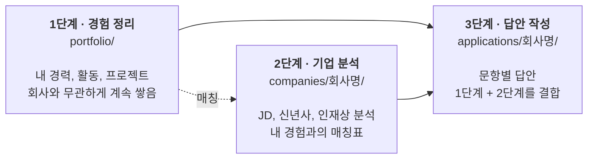
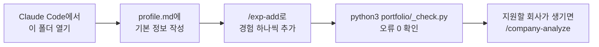
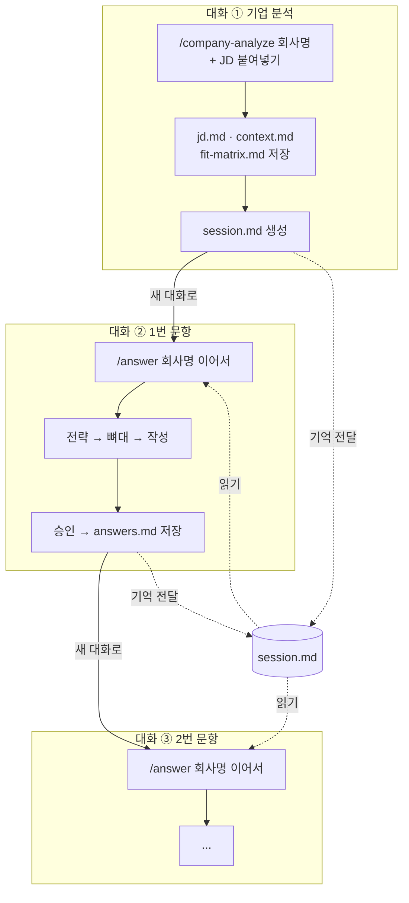
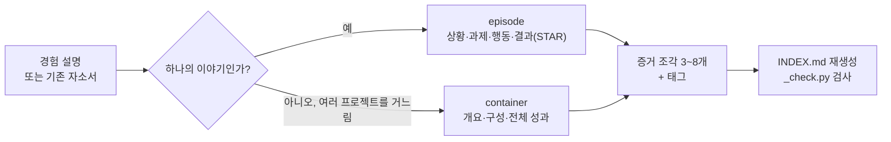
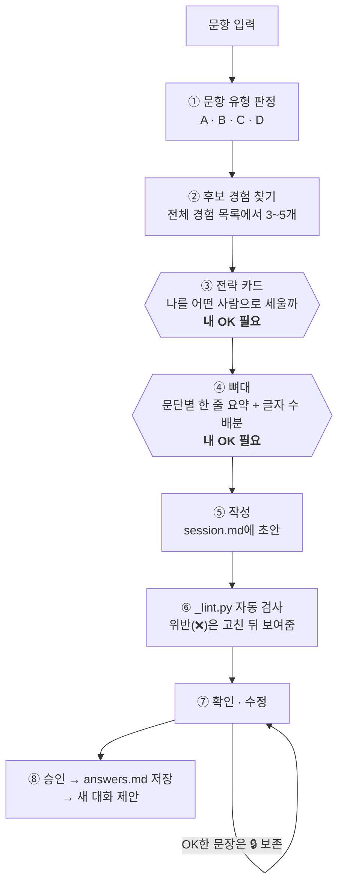
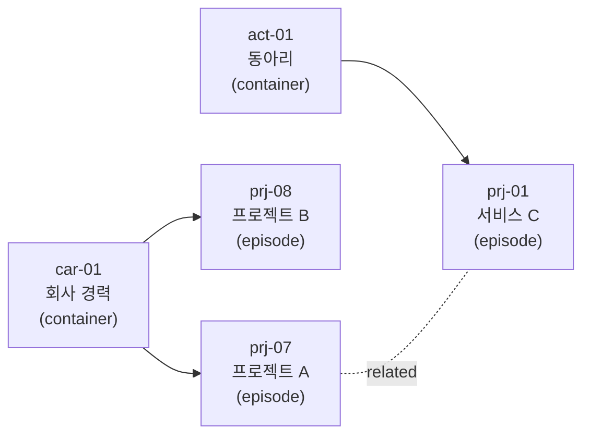

# 지원서 에이전트

내 경험을 정리해 두면, 지원하는 회사와 문항에 맞춰 **근거 있는 자기소개서 답안**을 함께 만들어 주는 Claude Code 에이전트입니다.

- 경험을 한 번 정리해 두면 어느 회사, 어느 직무에 지원하든 재사용합니다.
- 회사마다 JD와 신년사를 분석해 **"이 회사가 원하는 사람이 나다"**를 증명하는 방향으로 씁니다.
- 없는 경험이나 수치는 절대 만들지 않습니다. 모든 문장은 내가 정리한 경험 파일에 근거합니다.

> 이 저장소에는 **에이전트 구조(규칙, 스킬, 검사 스크립트, 템플릿)만** 들어 있습니다.
> 내 경험, 회사 분석, 답안 같은 개인 데이터는 `.gitignore`로 빠져 있어 내 컴퓨터에만 남습니다.

---

## 목차

1. [한눈에 보기](#1-한눈에-보기)
2. [핵심 원칙](#2-핵심-원칙)
3. [시작하기](#3-시작하기)
4. [실제로 지원할 때의 흐름](#4-실제로-지원할-때의-흐름)
5. [스킬 4개 자세히 보기](#5-스킬-4개-자세히-보기)
6. [세션 운영과 session.md](#6-세션-운영과-sessionmd)
7. [검사 스크립트 3종](#7-검사-스크립트-3종)
8. [경험 파일은 이렇게 생겼다](#8-경험-파일은-이렇게-생겼다)
9. [폴더 구조](#9-폴더-구조)
10. [업데이트와 버전](#10-업데이트와-버전)
11. [용어 사전](#11-용어-사전)

---

## 1. 한눈에 보기

에이전트는 **3단계**로 움직입니다. 데이터는 항상 왼쪽에서 오른쪽으로만 흐릅니다.



| 단계 | 명령 | 하는 일 | 언제 |
|---|---|---|---|
| 1. 경험 정리 | `/exp-add` | 경험을 파일로 정리하고 태그를 단다 | 새 경험이 생길 때마다 |
| 2. 기업 분석 | `/company-analyze` | JD와 회사 자료를 분석하고 내 경험과 맞춰 본다 | 지원할 회사마다 한 번 |
| 3. 답안 작성 | `/answer` | 문항에 맞는 경험을 골라 답안을 만든다 | 문항마다 |
| 자체 개선 | `/retro` | 결과물과 시스템을 스스로 채점하고 고친다 | 가끔, 또는 자동 |

---

## 2. 핵심 원칙

에이전트가 답안을 쓸 때 지키는 원칙입니다. 전체 규칙은 `.claude/CLAUDE.md`에 있습니다.

| 원칙 | 한 줄 설명 |
|---|---|
| **포지셔닝 먼저** | 답안은 "내 경험 소개"가 아니라 "HR이 나를 뽑을 이유"다. 무슨 경험을 쓸지보다 나를 어떤 사람으로 세울지가 먼저다. |
| **사실은 불가침** | 없는 경험, 부풀린 수치, 없는 인과는 절대 쓰지 않는다. |
| **표현은 적극적으로** | 사실인 범위에서는 가장 강한 표현을 쓴다. 불리한 내용은 생략해도 된다(생략은 거짓이 아니다). |
| **선별** | 경험을 욱여넣지 않는다. 1~2개를 골라 깊게 쓴다. |
| **재조립** | 저장된 경험을 복사해 붙이지 않는다. 문항에 맞춰 강조점을 다시 배치한다. |
| **읽히게** | JD에 있는 단어는 그대로, 없는 단어는 풀어서 쓴다. 한 문장에는 한 메시지만. |
| **직무 중립** | 특정 회사나 직무를 전제하지 않는다. 지원할 때마다 전략을 새로 세운다. |

판단이 애매할 때 쓰는 기준은 하나입니다.

> **"면접에서 이 문장을 파고들면 진짜 이야기를 이어갈 수 있는가?"**
> 이어갈 수 있으면 괜찮은 표현, 말이 막히면 거짓입니다.

---

## 3. 시작하기

### 설치

```bash
git clone https://github.com/ssxrxbx/Resume.git
cd Resume

# 개인 파일은 템플릿을 복사해서 만든다 (git에 올라가지 않음)
cp portfolio/_templates/profile.md    portfolio/profile.md
cp portfolio/_templates/INDEX.md      portfolio/INDEX.md
cp portfolio/_templates/TAGS.md       portfolio/TAGS.md
cp portfolio/_templates/IMPROVEMENTS.md IMPROVEMENTS.md
```

### 처음 할 일



- `/exp-add`는 이력서, 기존 자소서를 붙여 넣어도 되고, "정리할 게 있어"라고만 해도 질문하며 채워 줍니다.
- `profile.md`의 **「에이전트 설정」**에는 톤 기준이 될 답안(마음에 드는 확정 답안)을 적어 둡니다. 처음에는 비워 둬도 되고, 첫 승인 답안이 생기면 등록합니다.

---

## 4. 실제로 지원할 때의 흐름

한 회사에 지원할 때는 **작업 하나당 대화(세션) 하나**로 진행합니다. 대화가 길어지면 토큰 비용이 커지고 예전 초안이 섞여 품질이 떨어지기 때문입니다. 대화 사이의 기억은 `session.md` 파일이 넘겨줍니다.



- 작업이 끝나면 에이전트가 먼저 **"여기서 새 대화로 넘어가세요"**라고 제안합니다. 끊을지는 내가 정합니다.
- 새 대화에서는 `/answer 회사명 이어서`라고만 하면 `session.md`를 읽고 이어갑니다.

---

## 5. 스킬 4개 자세히 보기

### `/exp-add` — 경험 정리 (1단계)

경험 하나를 파일 하나로 만듭니다. 이게 모든 답안의 재료가 됩니다.



- 수치가 비어 있으면 "그때 수치로 어느 정도였나요?"처럼 되묻습니다.
- "설계·구축" 같은 강한 동사나 "수상"이 나오면 과장이 아닌지 한 번 더 확인합니다.

### `/company-analyze` — 기업 분석 (2단계)

회사명과 JD만 주면, 회사 자료는 에이전트가 직접 찾습니다.

| 만드는 파일 | 담기는 내용 |
|---|---|
| `jd.md` | JD 원문, 필수/우대 역량, **HR 관점**(지원 유형, 탈락 사유 Top 3, 문항별로 HR이 진짜 보려는 것) |
| `context.md` | 인재상과 톤, 이 회사가 돈을 버는 방식, 지원 조직이 실제로 하는 일 (출처 링크 포함) |
| `fit-matrix.md` | 요구 역량 ↔ 내 경험 매칭표 (✅ 충족 / △ 일부 / ✗ 공백) |
| `jd-compare.md` | JD가 여러 개일 때만. 적합도 %와 추천 순위 |

**지원 유형**은 매번 새로 판정합니다. 같은 경험이라도 유형에 따라 강점과 약점이 뒤집히기 때문입니다.

| 지원 유형 | 뜻 | HR이 가장 의심하는 것 |
|---|---|---|
| 직무 정합 | 지금 하는 일 = 지원하는 일 | "같은 경력자가 많은데 왜 이 사람이고, 왜 우리 회사인가" |
| 인접 이동 | 분야는 같고 역할이 다름 | "그 역할은 실제로 안 해봤잖아" |
| 전환 | 분야도 역할도 다름 | "왜 바꾸려 하고, 와서 해낼 수 있나" |

### `/answer` — 답안 작성 (3단계)

가장 중요한 스킬입니다. **문장을 쓰기 전에 전략부터 확정**하고, 단계마다 내 OK를 받은 뒤 다음으로 넘어갑니다.



**① 문항 유형** — 문항마다 쓰는 방법이 다릅니다.

| 유형 | 예시 문항 | 쓰는 방법 |
|---|---|---|
| **A** 경험 증명형 | 지원동기, 직무 역량, 협업, 실패 극복 | 경험을 골라 상황·행동·결과로 풀어 쓴다 |
| **B** 자기 규정형 | 성격 장단점, 가치관 | 특성을 한 문장으로 세우고 경험 1개로 짧게 뒷받침 |
| **C** 회사 이해형 | 우리 회사에 대해, 입사 후 계획 | 회사 분석이 주재료, 경험은 기여 근거로만 |
| **D** 항목 기입형 | 경력사항, 프로젝트, 수상 | 사실을 압축해 나열 (소제목은 선택) |

**③ 전략 카드** — 문장을 쓰기 전에 이 표부터 채웁니다.

| 칸 | 예시 |
|---|---|
| HR 판정 질문 | "이 사람은 우리 조직의 다른 부서들과 부딪히지 않고 일할 수 있나?" |
| 내 포지셔닝 | "기준이 다른 조직을 한 방향으로 모으는 사람" |
| 예상 반박 → 방어 | "학생 프로젝트 아니야?" → 실제 고객 검증 수치로 방어 |
| 승부처 | 이 문항에서 꼭 들어가야 할 것 1~2개 |
| 면접용 보류 | 지면상 빼고 면접에서 말할 것 |

**답안이 한 경험으로 도배되지 않게** 회사 단위로 경험 사용 횟수를 집계(`_usage.py`)하고, 편중이 보이면 대안을 함께 제시합니다.

### `/retro` — 자체 평가·개선

답안과 분석을 원칙 기준으로 스스로 채점하고, 개선점을 `IMPROVEMENTS.md`에 기록합니다.

- 산출물을 낼 때마다 짧게 자동 채점합니다.
- `/retro`를 직접 부르면 최근 결과물과 시스템 전체를 깊게 점검합니다.

---

## 6. 세션 운영과 session.md

### 왜 대화를 끊나?

AI는 답할 때마다 **그때까지의 대화 전체를 다시 읽습니다.** 대화가 길어질수록 한 번 답할 때 읽는 양이 계속 커집니다.

실제 기록 한 건(회사 한 곳의 문항 4개를 대화 하나로 진행)에서, 에이전트가 **한 번 답할 때마다 다시 읽은 양**은 이렇게 늘었습니다.

| 시점 | 한 번 답할 때 읽는 양 |
|---|---|
| 1번 문항 작성 중 | 약 38만 토큰 |
| 2번 문항 작성 중 | 약 45만 토큰 |
| 4번 문항 작성 중 | 약 79만 토큰 |

4번을 쓰는 동안에도 1~3번의 버린 초안까지 계속 다시 읽은 셈입니다. 작업마다 새 대화를 열면 매번 필요한 파일만 읽고 시작하므로, 과거 기록으로 계산했을 때 **전체 토큰이 최소 28%, 긴 지원은 최대 65%** 줄어듭니다.

### session.md에는 무엇이 들어가나?

대화가 끊겨도 잃으면 안 되는 **현재 상태만** 담습니다. 이력은 쌓지 않고 덮어씁니다.

```markdown
# 회사명 지원 세션 상태
> 다음 할 일: 3번 문항 뼈대 확정

## 지원 공통
| # | 문항         | 글자 수 | 유형 | 상태    |
|---|--------------|--------|------|---------|
| 1 | 지원동기     | 800자  | A    | ✅ 저장 |
| 2 | 협업 경험    | 1000자 | A    | ✅ 저장 |
| 3 | 문제 해결    | 1000자 | A    | ◐ 진행  |

### 이번 지원 전용 지시
- 문항끼리 같은 경험 얘기로 겹치지 않게

## 진행 중
- 문항: 3번, 1000자, A형
### 전략 카드 (확정)
### 뼈대 (확정)
### 🔒 승인 문장        ← 내가 OK한 문장. 새 대화가 다시 고치지 않는다
### 현재 초안           ← 최신 1개만
### 열린 결정
```

| 이런 말을 하면 | 저장되는 곳 |
|---|---|
| "이번 지원에서는 ~하자" | `session.md` 「이번 지원 전용 지시」 |
| "앞으로도 계속 ~하자" | 에이전트 규칙(스킬) 또는 메모리 |
| "그 수치 사실 틀렸어" | `portfolio/` 경험 원본 파일 |

---

## 7. 검사 스크립트 3종

눈으로 훑지 않고 스크립트로 확인합니다. 에이전트가 알아서 실행하지만, 직접 돌려 봐도 됩니다.

| 스크립트 | 무엇을 보나 | 언제 |
|---|---|---|
| `python3 portfolio/_check.py` | 경험 파일과 INDEX가 어긋나지 않았는지, 태그·연결이 맞는지 | 경험을 추가·수정한 뒤 |
| `python3 portfolio/_usage.py 회사명` | 그 회사 답안에서 어떤 경험을 몇 번 썼는지, 한쪽에 쏠렸는지 | 답안 쓰기 전 |
| `python3 portfolio/_lint.py 회사명` | 초안의 글자 수, 문장 길이, 금지 표현, 🔒 문장 보존, 복붙 여부 | 초안을 보여주기 전 (자동) |

### `_lint.py`가 검사하는 것

| 검사 | 걸리는 예 | 판정 |
|---|---|---|
| 글자 수 | 제한 초과 / 제한의 95% 미만 | 초과 ❌ / 미만 ⚠️ |
| 소제목 | 서술형인데 `[ ]` 소제목이 없음, "~하겠습니다"로 끝남 | ❌ |
| 문장 길이 | 서술형 100자 넘는 문장 / 80자 넘는 문장 | ❌ / ⚠️ |
| 금지 표현 | 가운뎃점(·), 첫째/둘째, 구어체("들여다봤습니다") | ❌ |
| 틀에 박힌 연결 | "이를 통해", "또한", "나아가" | ⚠️ |
| "그 결과" | 진짜 인과인지 확인 필요한 위치 | ⚠️ |
| 🔒 승인 문장 | 내가 OK한 문장이 바뀌거나 빠짐 | ❌ |
| 원본 복붙 | 경험 파일 문장을 30자 이상 그대로 가져옴 | ⚠️ |
| 문항 간 중복 | 같은 회사 다른 문항과 25자 이상 겹침 | ⚠️ |

- ❌ = 규칙 위반. 에이전트가 고친 뒤에 보여줍니다.
- ⚠️ = 판단이 필요. 에이전트가 확인하고 이유가 있으면 둡니다.
- 판정 기준은 실제 승인 답안 39건이 모두 통과하도록 맞춰 두었습니다.

출력 예시:

```
■ 회사명 진행 중 3번, 1000자, A형 — 공백 포함 982 / 제외 758
✅ 글자 수 982/1000 (98%) · 소제목 [...] · 금지 표현 없음 · 🔒 승인 문장 3/3 보존
⚠️  "그 결과" 인과 확인: "…요구사항을 다시 정리했습니다" → "그 결과 기한 안에…"
→ ❌ 0 · ⚠️ 1
```

---

## 8. 경험 파일은 이렇게 생겼다

경험 1건 = 파일 1개입니다. 여러 경험을 한 파일에 합치지 않습니다.



| 구분 | 접두어 | 예 |
|---|---|---|
| 경력 | `car-` | 인턴, 연구실, 군 |
| 대외활동 | `act-` | 동아리, 서포터즈, 연수 |
| 프로젝트 | `prj-` | 구체적인 산출물 |

파일 하나의 구조:

```markdown
---
id: prj-07
category: 프로젝트
type: episode
tags: [기획, 문제해결, 커뮤니케이션]   ← 매칭에 쓰는 태그 (TAGS.md 어휘만)
activity: car-01                         ← 소속 연결
quant: true                              ← 수치가 있는가
---
## S — 상황 / ## T — 과제 / ## A — 행동 / ## R — 결과

## 증거 조각                            ← 답안의 실제 재료
- `[분석]` 응답 지연 20초의 원인을 API 12개 동기 호출 구조로 규명
- `[데이터]` 설문 32명, 인터뷰 8건으로 초기 가설 검증
```

**증거 조각**은 답안에 꺼내 쓸 사실만 한 줄씩 쪼갠 목록입니다. 에이전트는 본문을 매번 새로 해석하지 않고 이 조각을 골라 조립합니다. 그래서 같은 경험이 문항마다 다른 사실로 흔들리지 않습니다.

---

## 9. 폴더 구조

```
Resume/
├── .claude/
│   ├── CLAUDE.md                 운영 규칙 (모든 대화에서 자동으로 읽힘)
│   └── skills/                   스킬 4종 (exp-add, company-analyze, answer, retro)
├── AGENTS.md, .agents/           Codex용 사본
├── portfolio/
│   ├── _check.py                 정합성 검사
│   ├── _usage.py                 경험 사용 이력·편중 집계
│   ├── _lint.py                  답안 문체·형식 검사
│   ├── _templates/               모든 템플릿 (경험, INDEX, TAGS, profile, session)
│   │
│   ├── career/      car-*.md     ┐
│   ├── activities/  act-*.md     │
│   ├── projects/    prj-*.md     │
│   ├── profile.md                │
│   ├── INDEX.md                  │  🔒 개인 데이터
│   └── TAGS.md                   │     내 컴퓨터에만 있고
├── companies/회사명/              │     GitHub에 올라가지 않음
│   └── jd · context · fit-matrix │
├── applications/회사명/           │
│   └── answers · session         │
├── IMPROVEMENTS.md               ┘
├── CHANGELOG.md                  버전별 변경 이력
└── README.md
```

| 공개 (GitHub) | 개인 (내 컴퓨터만) |
|---|---|
| 규칙, 스킬, 검사 스크립트, 템플릿, 문서 | 경험 파일, 프로필, 회사 분석, 답안, 개선 로그 |

---

## 10. 업데이트와 버전

```bash
git pull
```

- 개인 데이터는 git이 추적하지 않으므로 `git pull`로 덮어써지지 않습니다.
- 버전은 태그로 관리하고, 무엇이 바뀌었는지는 [`CHANGELOG.md`](CHANGELOG.md)에 적습니다.
  - 규칙이나 스킬 동작이 바뀌면 `v1.x.0`
  - 문구나 오탈자만 고치면 `v1.x.y`

⚠️ 개인 데이터는 버전 관리가 되지 않으니 가끔 폴더를 따로 백업해 두세요.

---

## 11. 용어 사전

| 용어 | 뜻 |
|---|---|
| **STAR** | 상황(Situation), 과제(Task), 행동(Action), 결과(Result). 경험을 이야기로 정리하는 틀 |
| **episode** | 하나의 이야기로 말할 수 있는 경험. STAR를 가진다 |
| **container** | 여러 프로젝트를 거느린 기간이나 소속(예: 회사 경력 전체). STAR 없이 개요와 하위 프로젝트 링크를 가진다 |
| **증거 조각** | 경험에서 답안에 꺼내 쓸 사실만 한 줄씩 쪼갠 목록 |
| **태그** | 경험에 다는 역량 키워드. `TAGS.md`에 정해진 단어만 쓴다 |
| **frontmatter** | 파일 맨 위 `---` 사이의 정보 칸(id, 태그, 연결 등) |
| **INDEX** | 모든 경험의 목록과 태그별 색인. 경험 파일에서 자동으로 다시 만든다 |
| **계열** | container와 그 하위 프로젝트 묶음. 편중을 셀 때 한 묶음으로 본다 |
| **지원 유형** | 직무 정합 / 인접 이동 / 전환. 지원할 때마다 새로 판정 |
| **문항 유형** | A 경험 증명 / B 자기 규정 / C 회사 이해 / D 항목 기입 |
| **포지셔닝** | 이 답안에서 나를 어떤 사람으로 세울지 한 문장으로 정한 것 |
| **전략 카드** | 문장을 쓰기 전에 확정하는 표(HR 판정 질문, 포지셔닝, 반박 방어 등) |
| **게이트** | 다음 단계로 가기 전에 사용자 OK를 받는 지점(전략 카드, 뼈대) |
| **🔒 승인 문장** | 내가 OK한 문장. 이후 누구도 다시 고치지 않는다 |
| **session.md** | 대화를 새로 열어도 이어갈 수 있게 현재 상태를 넘겨주는 인계 파일 |
